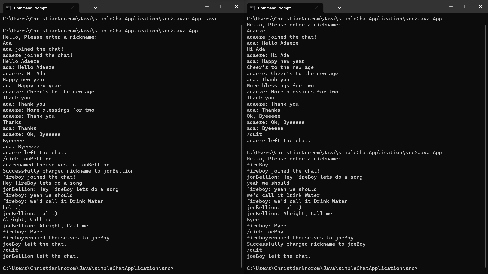

# Java Console Simple Chat Application

## Overview

The Java Chat Client is a simple console-based client application that connects to a Java Chat Server. It allows users to send messages to the chat, change nicknames, and gracefully exit the chat. The client establishes a socket connection to the server and communicates through input and output streams.

The Java Chat Server is a multithreaded server application that facilitates communication between multiple clients in a chat room. Clients can connect to the server, choose nicknames, send messages, change nicknames, and gracefully exit the chat. The server uses Java's `ServerSocket` for handling incoming connections and `ExecutorService` for managing multiple threads to handle client connections concurrently.

## Features

- Connect to a Java Chat Server running on `127.0.0.1` and port `9999`.
- Send messages to the chat.
- Change nickname using the `/nick` command.
- Gracefully exit the chat using the `/quit` command.
- Multithreaded server architecture.
- Clients can join the chat, choose nicknames, and send messages.
- Nickname changing functionality using the `/nick` command.
- Graceful exit with the `/quit` command.
- Dynamic broadcast of messages to all connected clients.
- Robust error handling for client disconnections.

## Preview



## How to Use

1. **Connect to Server**: The client connects to the server running on `127.0.0.1` and port `9999`.
2. **Set Nickname**: Upon connection, clients are prompted to enter a nickname.
3. **Send Messages**: Enter messages in the console to send them to the chat.
4. **Change Nickname**: Use the `/nick` command followed by the desired nickname to change it.
5. **Exit Chat**: Type `/quit` to gracefully exit the chat.

## Implementation Details

- The server runs on port `9999` by default.
- The client establishes a socket connection to the server.
- Communication with the server is done using `BufferedReader` and `PrintWriter` streams.
- Input and output are handled in separate threads for asynchronous communication.
- Each client connection is handled by a separate thread using `ExecutorService`.
- Communication between clients and the server is achieved through `BufferedReader` and `PrintWriter` streams.
- The server broadcasts messages to all connected clients.

## How to Run

1. Compile the `App.java` file:

```bash
   javac App.java
   java App
```

## Contributions

Contributions are welcome! Feel free to submit issues or pull requests.

## License

This project is licensed under the MIT License - see the LICENSE file for details.
